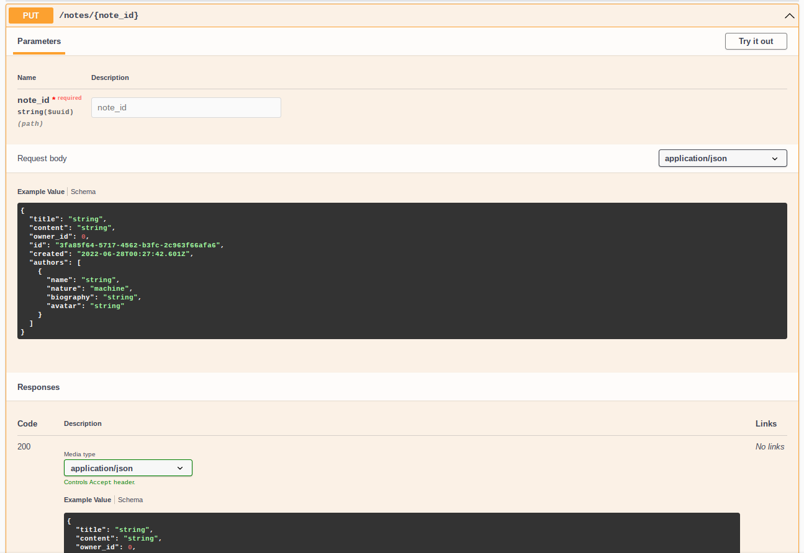

# aiohttp-openapi

Aoihttp-openapi is a parser for HTTP requests and an OpenAPI document generator
for aiohttp services.


## Motivation

When using aiohttp creating a handler is quite simple.
For example, let's consider a service that can store simple user's notes in a simple
key-value storage.
We might write an endpoint for editing notes like this:

```python
async def put_note(request):
    note_id_str = request.match_info["id"]
    note_id = uuid.UUID(note_id_str)
    json_body= await request.json()
    new_note = models.Note.parse_obj(json_body)
    old_note: pydantic.BaseModel = storage.get(note_id)
    if not old_note:
        return web.json_response(reason="Note not found", status=404)
    storage.set(note_id, new_note)
    return web.json_response(text=new_note.json())
```
Here we assume that we have a pydantic model `models.Note`, witch does
all heavy lifting related to json representation and validation of notes.

Yet this handler is not very useful for production usage for two reasons:

1. `note_id_str` may not be a valid UUID string, and request body may not be
    correct JSON or valid representation of the `Note` model, and our code raises
    an exception in this case. Usually we simply want to return `400 Bad Request`
    in such cases, but doing this for every parameter may lead to a lot of
    boilerplate code, especially if we want to describe bad parameter:

    ```python
    async def put_note(request):
        note_id_str = request.match_info["id"]
        try:
            note_id = uuid.UUID(note_id_str)
            json_body= await request.json()
            new_note = models.Note.parse_obj(json_body)
        except ValueError as e:
            return weh.json_response(
                {"in": "path", "name": "id", "msg": str(e)}, status=400
            )
        except json.JsonDecodeError as e:
            return web.json_response({
                "in": "body", "type": "JsonDecodeError", "msg": str(e), status=400
            })
        except pydantic.ValidationError as e:
            return weh.json_response(text=e.json(), status=400)
        ...
    ```
2. When exchanging API of our service with frontend developers, colleagues,
    other companies, testers, API designers, etc. we may need an OpenAPI document
    for our service, also known as Swagger document. Writing one by hand is not
    a trivial task because the document has it's own syntax and tends to have
    recurrent parts, reducing of which requires efforts similar to programming.
    But the principal disadvantage of this approach is that we need to synchronize
    this OpenAPI document with the code after every change of the code, and this
    is prone to human errors and requires great amount of discipline on early
    stages of development, when the API is not very stable.

Aiohttp-openapi offers following solution to this problems:

1. Developers declare names, types and location of the parameters they want to
   extract from request instead of imperative extraction.
   See [Usage](#usage) section for particular mechanisms for that.
   The library takes care of the actual extraction of the parameters from the request
   and handling common exceptions in requests that do not fit for declared format
   and provides useful responses to a client.
2. This declaration is also used by the library for generation of an OpenAPI
   document, providing a document that always remain up-to-date with the code.
   The document can be saved to disk or served as HTTP page by the
   application itself. This part of functionality is optional.


# Usage

Package offers two ways of declaring parameters:

1. The first one uses python arguments with default values instead of one
   `request` parameter used by aiohttp library.

    ```python
    from aiohhttp_openapi import openapi_view, Json, Param

    @openapi_view
    async def put_note(note_id=Param(uuid.UUID), new_note=Json(models.Note)):
        assert isinstance(note_id, uuid.UUID)
        assert isinstance(new_note, pydantic.BaseModel)
    ```

    Each [parameter](https://docs.python.org/3/glossary.html#term-parameter)
    of the function `put_note` have a default value we call
    _extractor_, an instance of `aiohttp_openapi.extractors.Extractor`,
    for example `Param(uuid.UUID)`.
    The class of extractor contains information about location of a value in
    the HTTP request, and the _parser_ (`uuid.UUID` in this case) will determine
    the type of the value.
    `Param` is used both to extract values from path and query HTTP parameters.
    Library will use the information from `app.router` to distinguish between 
    them.
    Decorator `openapi_view` wraps function `put_note` with an
    aiohttp-compatible handler that accepts a single `request` argument and 
    performs the extraction of the parameters in runtime, so that `put_note`
    function receives extracted from HTTP request values as 
    [arguments](https://docs.python.org/3/glossary.html#term-argument) 
    instead of extractors.

2. The second way is to use
   [annotation](https://docs.python.org/3/glossary.html#term-anotation)
   to provide parser for value:

    ```python
    from aiohhttp_openapi import openapi_view, Json, Param

    @openapi_view
    async def put_note(note_id: uuid.UUID, new_note: models.Note) -> models.Note:
        assert isinstance(note_id, uuid.UUID)
        assert isinstance(new_note, pydantic.BaseModel)
    ```
    The result is the same as above. Library assumes that if the parser is a 
    Pydantic model than value is in request body and JSON-encoded, and otherwise
    it is path or query HTTP parameter.

    The return annotation is optional and allows to specify a 'good' response in
    schema.

After applying an `openapi_view` decorator to handlers we should connect the 
library to the application object so that the library could use routes 
information to determine path parameters and build _schema_ - python dictionary 
that used as source to generate OpenAPI document page and could be exported as 
JSON or YAML file.

```python
from aiohttp import web
import aiohhttp_openapi

app = web.Application()
app.router.add_put("/notes/{note_id}", put_note)
aiohttp_openapi.publish_schema(
    app,
    title="Notes API",    # required for schema
    version="1.0.0",      # required for schema
    url_path="/api/doc",  # Serve html with swagger-ui-py page with schema
    yaml_path="/tmp/notes_api.yaml",  # Save schema to file
)
```

Visiting `http://localhost/api/doc` will show OpenAPI document like this:



## Demo (more complex cases)

See [demo](tests/demo_notes) package for examples of more complex usage of the
library API, including:

- saving original `request` for special cases or gradual transfer.
- multipart requests
- class based views
- default values for parameters both in python code and schema
- aliases for parameters (you can have `note_id` in your code while `noteId`
  will be exposed to client of your service)
- generating `summary` and `description` for schema from docstrings
- customization of generated schema (e.g. mark endpoint deprecated in schema,
  tags to group endpoints in OpenAPI document).

Most of the functionality can be achieved with extractors-based approach, shown
in [views_extractors.py](tests/demo_notes/views_extractors.py).
To run demo with the extractors implementation of views run

```shell
make demo
```
Root page will http://localhost:8000 will contain APIDocument for the demo
application.

To run demo with other approaches use:

```shell
view=annotations make demo  # annotations approach
view=classes make demo      # class based views
view=aiohttp make demo      # bare aiohttp implementation, no OpeanAPI docuement
view=extractors make demo   # extractors approach, the same as `make demo`
```


## Logging

The logging in the package provided by the standard
[`logging`](https://docs.python.org/3/library/logging.html) package.
By default logs are disabled by using `logging.NullHandler()`. In general the
library approaches strictly to the requests parsing and most of the  schema
building raising exceptions instead of logging errors.
But in some cases it may fail to generate the precise schema for and OpenAPI 
document, building less accurate schema without raising an exception. 
For example it may use common `string` type in schema when dealing
with unexpected types. In this cases enabling logger may help to
identify the problematic parameter:

```python
logger = logging.getLogger("aiohttp_openapi")
# also logger = aiohttp_openapi.logger will do
logger.setLevel(logging.WARNING)
```


# Installation

- Using pip (from git repository):

    ```shell
    pip install git+https://gitlab.com/max.rms/aiohttp-openapi.git
    ```

- Pipfile (from git repository)

    ```
    [packages]
    aiohttp-openapi = {git = "https://gitlab.com/max.rms/aiohttp-openapi"}
    ```

- Building from source

    Run

    ```shell
    make dst
    ```
    from the root of the project.
    In `dist` directory you should find files:

    ```
    aiohttp_openapi-0.0.x-py3-none-any.whl
    aiohttp-openapi-0.0.x.tar.gz
    ```

    Than use pip to install package from wheel file:

    ```shell
    pip install dist/aiohttp_openapi-0.0.x-py3-none-any.whl
    ```


## Dependencies

- [aiohttp](https://docs.aiohttp.org)
- [pydantic](https://pydantic-docs.helpmanual.io/)
- [OpenAPI Spec validator](https://github.com/p1c2u/openapi-spec-validator)
- [swagger-ui-py](https://pypi.org/project/swagger-ui-py/)


## Build with

- [pytest](https://docs.pytest.org/)
- [Black](https://https://github.com/psf/black)
- [Flake8](https://flake8.pycqa.org/en/latest/)
- [isort](https://github.com/PyCQA/isort)
